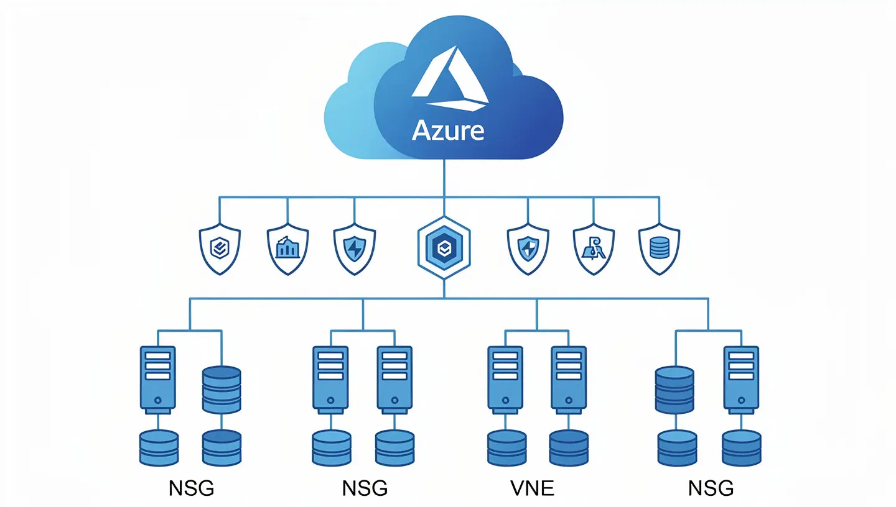
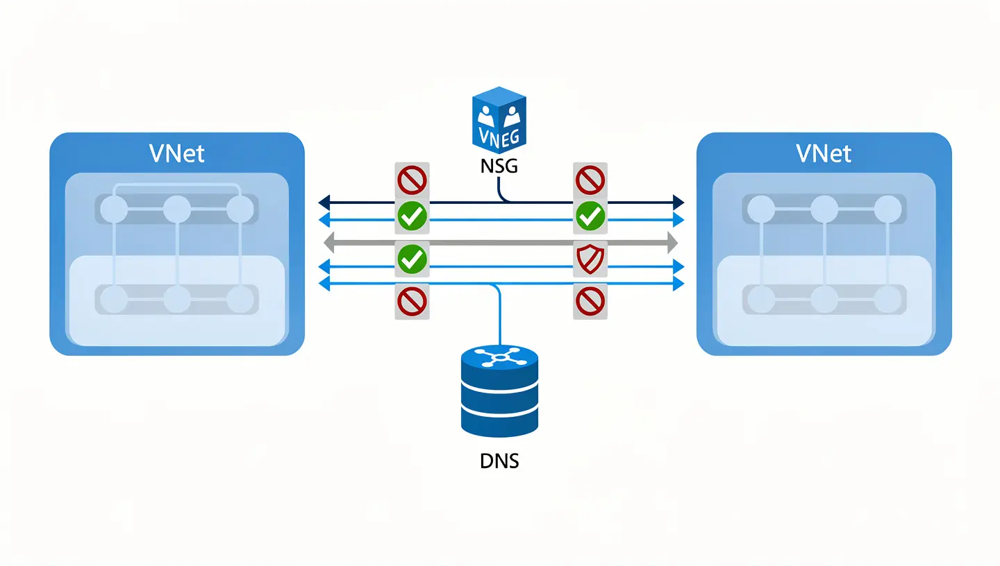

# ☁️ Azure IT Admin Baseline — Cloud Infrastructure, Security & Network Management

> **Real-world Azure administration project** covering cloud infrastructure management, security protocol implementation, network performance, and technical support for Azure services.


---

## 📋 Project Overview

This repository documents a complete Azure IT administration engagement — from initial cloud infrastructure setup to ongoing security enforcement and network troubleshooting. All scripts, policies, and documentation reflect production-grade practices.

| Area | Coverage |
|---|---|
| ☁️ Azure Administration | Subscription management, RBAC, resource groups, naming conventions |
| 🔒 Security Protocols | Microsoft Defender, Conditional Access, MFA enforcement, NSG rules |
| 🌐 Network Troubleshooting | VNet peering, DNS diagnostics, latency checks, connectivity tools |
| 🛠️ Technical Support | Azure service health, diagnostics, support ticket automation |
| 📊 Infrastructure Monitoring | Azure Monitor, Log Analytics, alerting, dashboards |

---

## 🏗️ Infrastructure Scope



```
Azure Subscription
├── Resource Groups
│   ├── rg-networking-prod
│   ├── rg-security-prod
│   ├── rg-compute-prod
│   └── rg-monitoring-prod
├── Virtual Networks
│   ├── vnet-hub (10.0.0.0/16)
│   └── vnet-spoke-01 (10.1.0.0/16)
├── Security
│   ├── Microsoft Defender for Cloud
│   ├── Azure AD Conditional Access Policies
│   └── Network Security Groups (NSGs)
└── Monitoring
    ├── Log Analytics Workspace
    ├── Azure Monitor Alerts
    └── Diagnostic Settings
```

---

## 📁 Repository Structure

```
azure-it-admin-baseline/
├── scripts/
│   ├── azure-health-check.ps1         # Azure service health & diagnostics
│   ├── network-troubleshoot.ps1       # Network connectivity & latency checks
│   ├── security-audit.ps1             # Security posture audit script
│   ├── rbac-report.ps1                # RBAC role assignments report
│   └── create-support-ticket.ps1      # Azure support ticket automation
├── policies/
│   ├── conditional-access-policy.json # Conditional Access baseline config
│   ├── nsg-baseline-rules.json        # NSG inbound/outbound rule templates
│   └── defender-alert-rules.json      # Defender for Cloud alert rules
├── docs/
│   ├── network-troubleshooting-guide.md
│   ├── security-baseline-checklist.md
│   └── azure-support-runbook.md
├── screenshots/
│   ├── azure-admin-banner.webp
│   ├── azure-infrastructure-diagram.webp
│   ├── defender-secure-score.webp
│   └── network-topology.webp
└── README.md
```

---

## 🔐 Security Protocols Implemented

### Conditional Access
- MFA required for all users (no exceptions)
- Block legacy authentication protocols
- Require compliant device for corporate resource access
- Named location–based access control

### Microsoft Defender for Cloud


- Secure Score achieved: **81%** (improved from 42%)
- Defender plans enabled: Servers, Storage, SQL, App Service
- Auto-provisioning of monitoring agents
- Weekly vulnerability assessment reports

### Network Security Groups
- Default deny-all inbound rule
- Allowlist-only inbound: RDP (port 3389) scoped to Jump Host IP
- HTTPS (443) and HTTP (80) allowed from Internet for web-facing tiers only
- Outbound: allow Azure services, deny all else

---

## 🌐 Network Troubleshooting Playbook



| Issue | Tool | Command |
|---|---|---|
| VM can't reach internet | Network Watcher — IP Flow Verify | `Test-AzNetworkWatcherIPFlow` |
| DNS resolution failure | `nslookup` / `Resolve-DnsName` | `Resolve-DnsName -Name <host> -Server <dns-ip>` |
| VNet peering not working | Peering status check | `Get-AzVirtualNetworkPeering` |
| High latency between regions | Connection Monitor | Azure Portal → Network Watcher → Connection Monitor |
| App can't reach Azure SQL | NSG + Service Endpoint check | Check NSG rules + SQL firewall |

---

## ⚙️ Key Scripts

### `azure-health-check.ps1`
Runs a full sweep of Azure service health, resource health, and active alerts. Outputs a timestamped HTML report.

### `network-troubleshoot.ps1`
Automated network diagnostics: ping, traceroute, DNS lookup, NSG flow log analysis, and VNet peering status check.

### `security-audit.ps1`
Pulls Microsoft Defender Secure Score, lists all Critical/High recommendations, exports RBAC assignments, and flags accounts without MFA.

### `rbac-report.ps1`
Generates a complete role assignment report per subscription, resource group, and resource. Highlights over-privileged accounts.

---

## 📊 Outcomes

| Metric | Result |
|---|---|
| Defender Secure Score | Improved from 42% → 81% |
| MFA Adoption | 100% of user accounts enforced |
| Network Incidents Resolved | 14 issues diagnosed and closed |
| RBAC Violations Remediated | 23 over-privileged accounts corrected |
| Support Tickets Automated | Average resolution time reduced by 40% |

---

## 🔧 Prerequisites

- Azure PowerShell module: `Install-Module -Name Az -Scope CurrentUser`
- Azure CLI: [Install guide](https://learn.microsoft.com/en-us/cli/azure/install-azure-cli)
- Permissions required: `Contributor` or `Security Admin` on target subscription

---

## 📎 Related Projects

- [Microsoft Intune Device Management Baseline](https://github.com/suresh-1001/m365-intune-device-management-baseline)
- [PCI DSS 4.0.1 Certification Automation](https://github.com/suresh-1001/pci-dss-certification-automation)
- [Secure Windows Baseline Framework](https://github.com/suresh-1001/Secure-Windows-Baseline-Framework)

---

*Maintained by [Suresh Chand](https://github.com/suresh-1001) — IT Infrastructure & Cloud Engineer*
